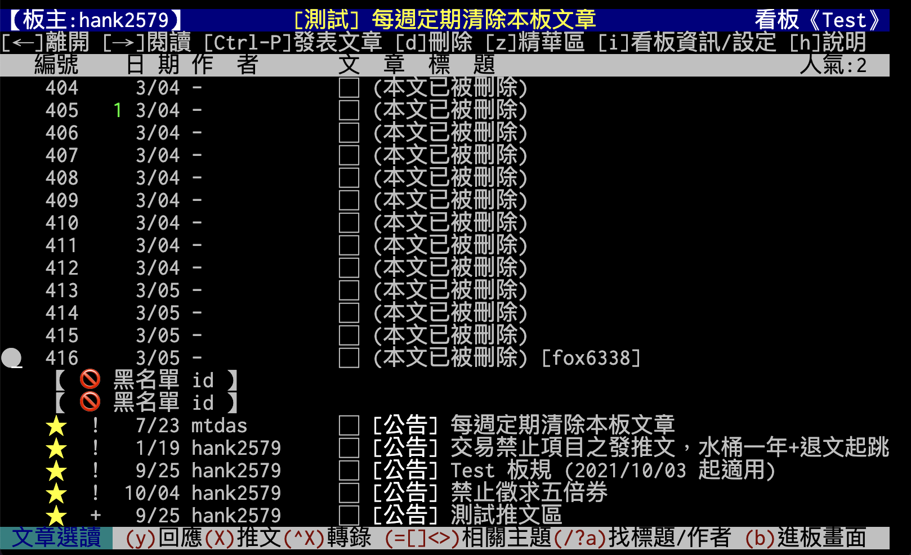
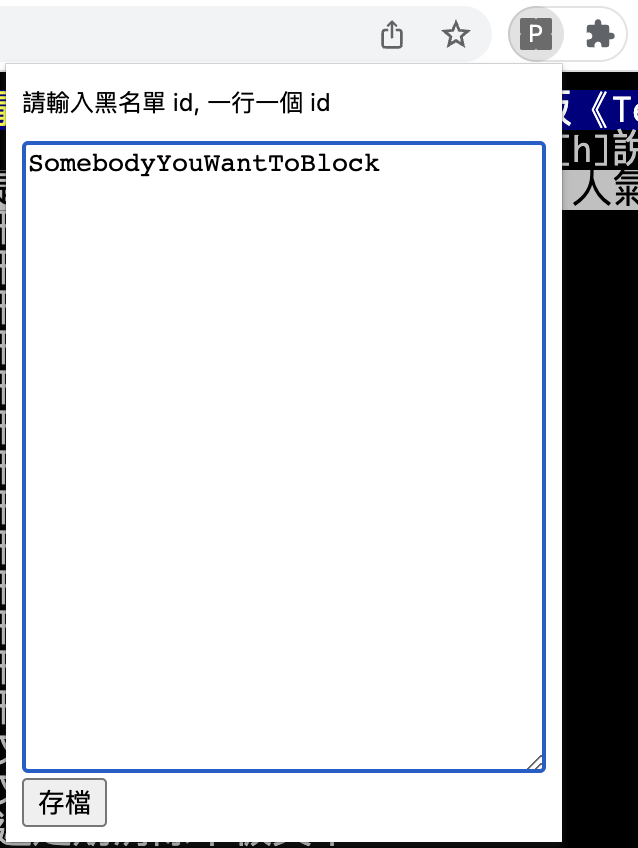
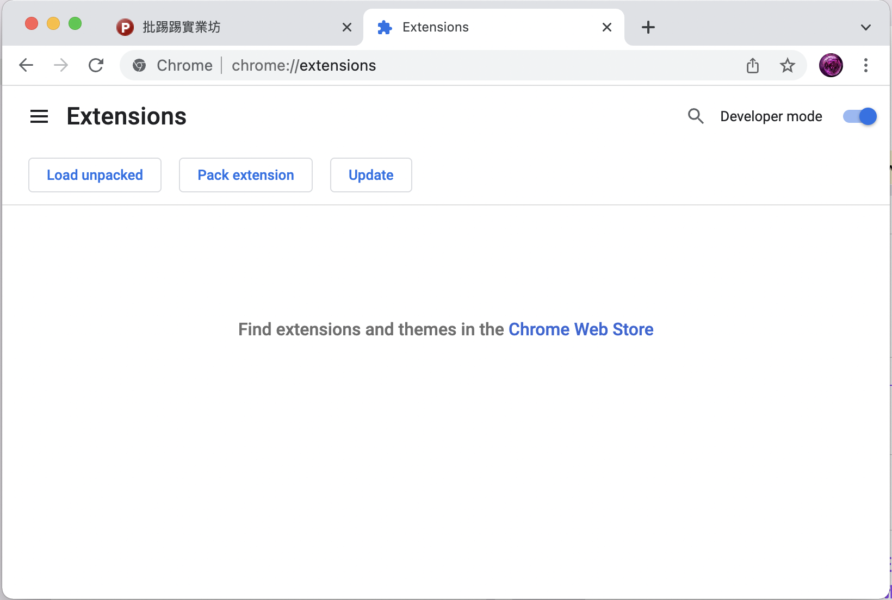

# ptt-blacklist

ptt-blacklist 是一個簡單的 chrome extension (也可用於 edge)

讓你在使用 https://term.ptt.cc 瀏覽 ptt 時, 幫你阻擋特定 id 的發文

## 使用方法

1. 按下 ptt-blacklist 的圖示後會出現一個小視窗
1. 把想要阻擋的 id 貼上並存檔
1. 動一動方向鍵, 重新刷新畫面即可看見效果

## 安裝教學

### chrome

1. 網址列輸入 chrome://extensions 打開設定頁
1. 打開右上角 Developer mode (開發人員模式) 開關
1. 點選 Load unpacked (載入未封裝項目), 載入 ptt-blacklist 資料夾即可

